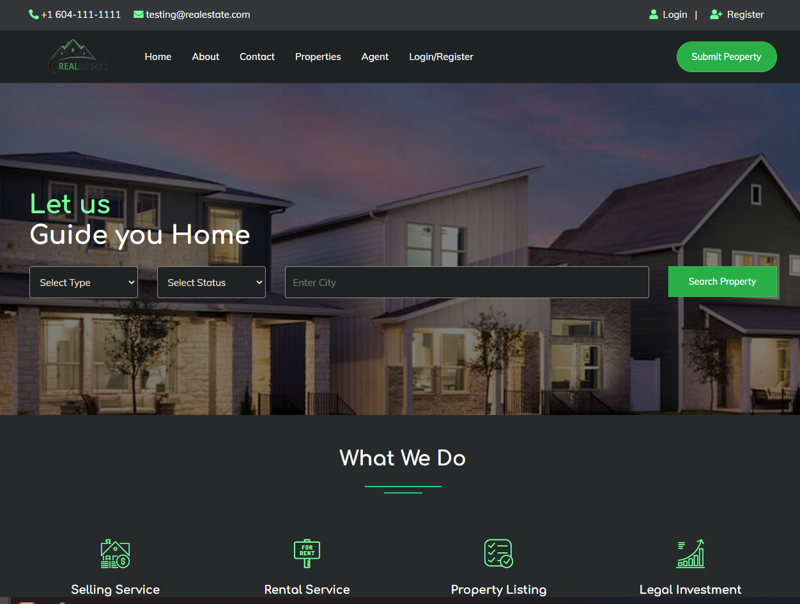
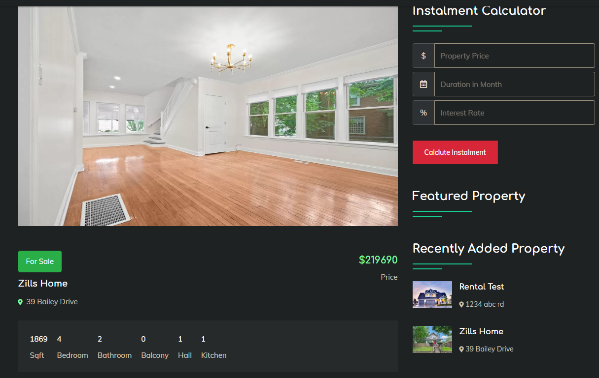
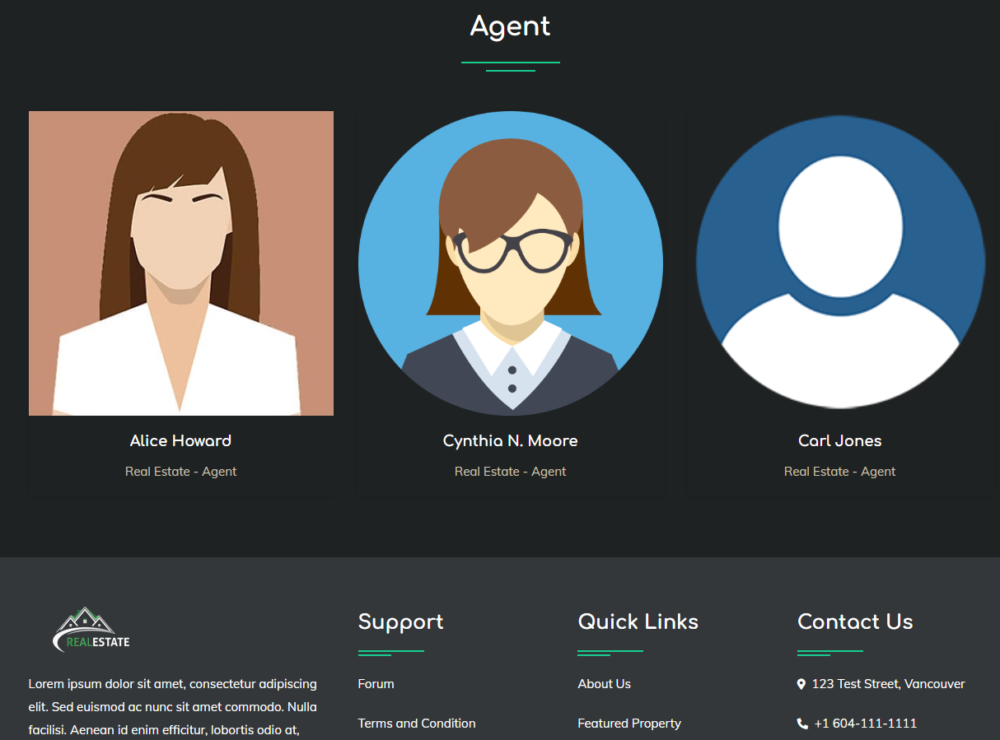

# RealEstate-PHP-Project

RealEstate-PHP-Project is a simple project based on Online Real Estate Management System Project that uses PHP Language with MySQL Database.





## Features

   *Register as an agent/seller to post the property for sale/rent

   *Upload/edit/delete photos and descriptions of the property

   *Contain an admin panel and a simple client-side

   *Provide screener for user to search for property with types, status and city


## Requirements

- XAMPP;
- VSCode;

## Procedures

1. Install XAMPP (see https://www.apachefriends.org/download.html) and VScode (see https://code.visualstudio.com/download)

2. Open XAMPP Control Panel

   *Start Apache and MySQL (If there is a connection problem with MySQL, change the port number and in Config under MySQL and under XAMPP - open XAMPP with administrator mode)

3. Open VSCode

   *Open terminal and enter

      ```
      git clone https://github.com/tonylai2022/RealEstate-PHP-Project.git 
      ```

4. Find the RealEstate-PHP-Project folder and move it into the htdocs folder in your XAMPP folder installed

5. Create a new data base in phpMyAdmin

   *Open admin under MySQL in XAMPP (If you an error, you may specify the port number under [mysqld] in the Config/myini file.)

   *In phpMyAdmin, click New on the left side bar and enter the database name as realestatephp then press Create 

   *Upload the sql file from your cloned file under DATABASE FILE

6. Reset password to connect the web server to the database

   *In phpMyAdmin, find the realestatephp you just created and go in

   *Click Privileges on the top --> Edit privlieges (username:root and hostname:localhost)

   *Click Change password on the top

   *Go to Apache Config --> myPhpAdmin file --> enter the password you set into $cfg['Servers'][$i]['password'] = 'your_password' and enter your MySQL port number into $cfg['Servers'][$i]['host'] = 'localhost:your_port_number';

7. Go to localhost/RealEstate-PHP-Project and log in.

   *Find the login info in 01 LOGIN DETAILS & PROJECT INFO.txt file

8. Enjoy and navigate the website!

***Credits to codeastro.com***
